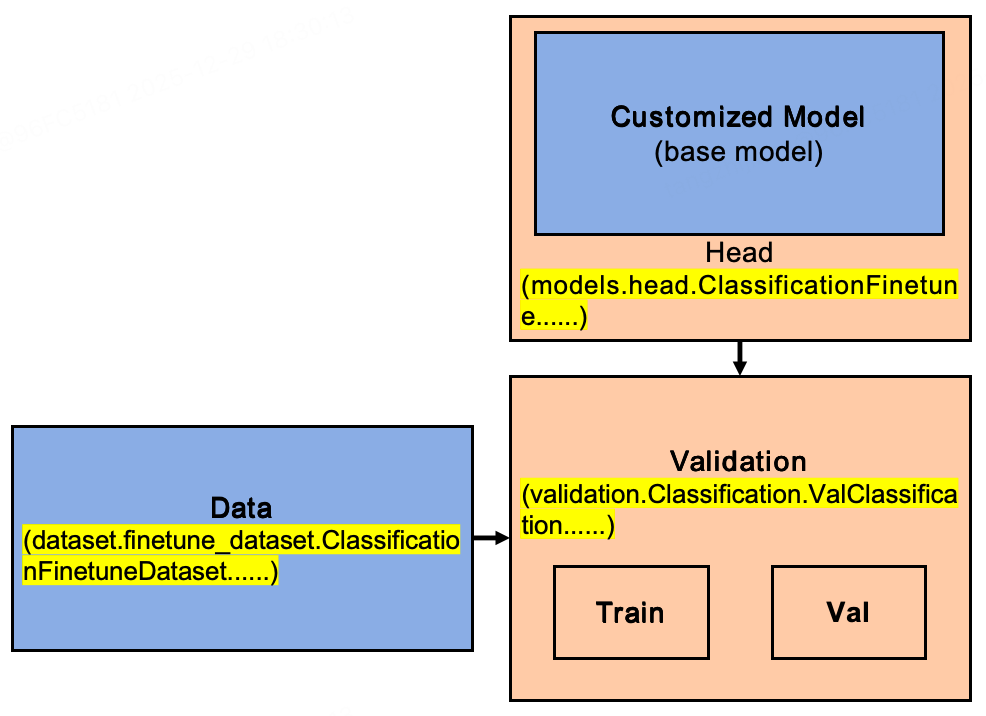
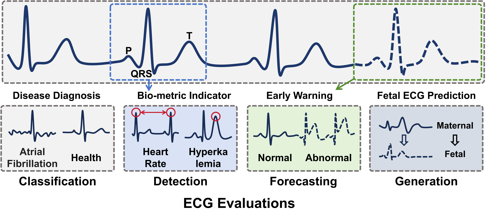

# ECG Benchmark
Author's implementation of *A Comprehensive Benchmark for Electrocardiogram Time-Series* 

[[📄ACM MM 2025]](https://dl.acm.org/doi/pdf/10.1145/3746027.3754729) [[📄ARXIV]](https://arxiv.org/abs/2507.14206) [[⭐CODE]](https://github.com/ZhijiangTang/ECG-Benchmark) [[📂DATA]](https://drive.google.com/drive/folders/1_BGJd7fPOPBFjB98Opuo5dir-nc-U1Ww?usp=sharing)

### Introduction
Electrocardiogram (ECG) is crucial for assessing cardiac health and diagnosing various diseases. Given its time-series format, ECG data is often incorporated into pre-training datasets for large-scale time-series model training. However, existing studies often overlook its unique characteristics and specialized downstream applications, which differ significantly from other time-series data, leading to an incomplete understanding of its properties.
In this paper, we present an in-depth investigation of ECG signals and establish a comprehensive benchmark, which includes (1) categorizing its downstream applications into four distinct evaluation tasks, (2) identifying limitations in traditional evaluation metrics for ECG analysis, and introducing a novel metric; (3) benchmarking SOTA time-series models and proposing a new architecture.
Extensive experiments demonstrate that our proposed benchmark is comprehensive and robust. The results validate the effectiveness of the proposed metric and model architecture, which establish a solid foundation for advancing research in ECG signal analysis.


### Updates
:triangular_flag_on_post: **News** (2025.12) Release evaluation code and our PSSM [[🧭Quick Start]](#quick-start).

:triangular_flag_on_post: **News** (2025.12) Release benchmark [[📂DATA]](https://drive.google.com/drive/folders/1_BGJd7fPOPBFjB98Opuo5dir-nc-U1Ww?usp=sharing).

:triangular_flag_on_post: **News** (2025.7) Accepted by [[📄ACM MM 2025]](https://dl.acm.org/doi/pdf/10.1145/3746027.3754729).

### TODO
- [ ] Release pre-training data and code
- [ ] Release large time-series models pre-trained in ECG


### Quick Start
##### Step 0. Prepare Environment
Download [[📂DATA]](https://drive.google.com/drive/folders/1_BGJd7fPOPBFjB98Opuo5dir-nc-U1Ww?usp=sharing) to ```Data``` folder, download [[🤖FFD]](https://drive.google.com/drive/folders/1s7KUgkWNOkT0f8rB9sBjeq9u1snWWvuo) model (for evaluation) to ```checkpoints``` folder.
```shell
pip install -r requirements.txt
```

##### Step 1. Run evaluation
```shell
python val_run.py \
    model=PSSM \
    data=ADFECGDB
```

#### Evaluate Your Custom Model
The ECG-Benchmark framework is shown below. You can follow the [[🧭Tutorial]](tutorial/val_customized_model.ipynb) to evaluate your own model.




### Benchmark
[[Google Drive]](https://drive.google.com/drive/folders/1_BGJd7fPOPBFjB98Opuo5dir-nc-U1Ww?usp=sharing) [[Quark Drive]](https://pan.quark.cn/s/634a9fcfd25a)

We define a set of evaluations designed for the broad range of medical applications of ECG, which include four downstream tasks:

1️⃣ **Classification** for disease diagnosis and event prediction,

2️⃣ **Detection** for key waveform (e.g., P-wave) localization,

3️⃣ **Forecasting** for ECG dynamics prediction,

4️⃣ **Generation** for maternal-fetal ECG separation.


These tasks provide a comprehensive framework for evaluation, and the following details the datasets used for each task in ECG-Benchmark. [[Google Drive]](https://drive.google.com/drive/folders/1_BGJd7fPOPBFjB98Opuo5dir-nc-U1Ww?usp=sharing) [[Quark Drive]](https://pan.quark.cn/s/634a9fcfd25a) have released the processed data used for evaluation.


| Task           | Name                         | Describe     | # Sample | # Subject | Channel | Frequency |
| -------------- | ---------------------------- | ------------ | -------- | --------- | ------- | --------- |
| Classification | **CPSC2018** [[📕Paper]](http://2018.icbeb.org/file/2018X_Feifei_An%20Open%20Access%20Database%20for%20Evaluating%20ECG%20abnormal%20classificaition%20algorithm.pdf)     | 7            | 205111   | 5847      | 12      | 500Hz     |
| Classification | **CPSC2021** [[📕Paper]](https://physionet.org/content/cpsc2021/1.0.0/)     | 3            | 330032   | 785       | 2       | 200Hz     |
| Classification | **AF** [[📕Paper]](https://physionet.org/content/challenge-2017/1.0.0/)          | 2            | 8400     | 35        | 7       | 125Hz     |
| Classification | **NIFEADB** [[📕Paper]](https://pubmed.ncbi.nlm.nih.gov/30602066/)     | 2            | 21293    | 26        | 6       | 1000Hz    |
| Classification | **RFAA** [[📕Paper]](https://pubmed.ncbi.nlm.nih.gov/27331073/)        | 4            | 38640    | 315       | 4       | 250Hz     |
| Classification | **SPB** [[📕Paper]](https://physionet.org/content/challenge-2020/1.0.2/training/st_petersburg_incart/)         | 6            | 34560    | 8         | 12      | 257Hz     |
| Detection      | **FEPL** [[📕Paper]](https://www.nature.com/articles/s41597-020-0538-z)        | Fetal QRS    | 37080    | 20        | 10      | 500Hz     |
| Detection      | **CPSC2020** [[📕Paper]](https://www.researchgate.net/publication/345142269_An_Open-Access_Long-Term_Wearable_ECG_Database_for_Premature_Ventricular_Contractions_and_Supraventricular_Premature_Beat_Detection)    | T-wave       | 175782   | 10        | 1       | 400Hz     |
| Detection      | **MITDB** [[📕Paper]](https://ieeexplore.ieee.org/document/932724)       | QRS          | 20810    | 71        | 2       | 360Hz     |
| Detection      | **MITPDB** [[📕Paper]](https://link.springer.com/chapter/10.1007/978-981-10-9038-7_72)      | P-wave       | 4269     | 12        | 2       | 360Hz     |
| Detection      | **NFE** [[📕Paper]](https://physionet.org/content/challenge-2013/1.0.0/)         | Fetal QRS    | 1200     | 25        | 4       | 1000Hz    |
| Detection      | **SVDB** [[📕Paper]](https://ieeexplore.ieee.org/abstract/document/144257)        | QRS          | 56160    | 78        | 2       | 128Hz     |
| Forecast       | **CPSC2019** [[📕Paper]](http://2019.icbeb.org/file/10_09JMIHI09-2800.pdf)    |              | 2000     | 2000      | 1       | 500Hz     |
| Forecast       | **RDBH** [[📕Paper]](https://ieeexplore.ieee.org/document/7043101)        |              | 22200    | 198       | 7       | 360Hz     |
| Forecast       | **MIMICSub** [[📕Paper]](https://www.nature.com/articles/sdata201635)     |              | 5552708  | 1210      | 8       | 125Hz     |
| Forecast       | **NFE** [[📕Paper]](https://physionet.org/content/challenge-2013/1.0.0/)                     |              | 5467     | 125       | 4       | 1000Hz    |
| Forecast       | **DALIA** [[📕Paper]](https://archive.ics.uci.edu/dataset/495/ppg+dalia)                    |              | 25887    | 15        | 2       | 100Hz     |
| Forecast       | **PTB** [[📕Paper]](https://www.degruyterbrill.com/document/doi/10.1515/bmte.1995.40.s1.317/html?srsltid=AfmBOorpVPy_6Tt8Adrbt2HRhRwcYMsov97Nb1F7DyO5pkkdfr0saGRt)                     |              | 130455   | 516       | 12      | 1000Hz    |
| Generation     | **ADFECGDB** [[📕Paper]](https://pubmed.ncbi.nlm.nih.gov/25854665/)                | Maternal ECG | 1200     | 5         | 5       | 1000Hz    |
| Generation     | **FEPL** [[📕Paper]](https://www.nature.com/articles/s41597-020-0538-z)                     | Maternal ECG | 7800     | 10        | 10      | 500Hz     |
| Generation     | **BIDMC** [[📕Paper]](https://ieeexplore.ieee.org/document/7748483)                    | PPG          | 4992     | 52        | 7       | 125Hz     |
| Generation     | **MITDB** [[📕Paper]](https://ieeexplore.ieee.org/document/932724)                    | Noise ECG    | 116196   | 69        | 2       | 360Hz     |
| Generation     | **PTBXL** [[📕Paper]](https://physionet.org/content/ptb-xl/1.0.3/)                    | Noise ECG    | 262044   | 21837     | 12      | 500Hz     |
| Generation     | **SST** [[📕Paper]](https://physionet.org/content/senssmarttech/1.0.0/)                     | PCG          | 6760     | 338       | 9       | 1000Hz    |


### Citation
If you find this repo helpful, please cite our paper. 

```
@inproceedings{tang2025comprehensive,
  title={A Comprehensive Benchmark for Electrocardiogram Time-Series},
  author={Tang, Zhijiang and Qi, Jiaxin and Zheng, Yuhua and Huang, Jianqiang},
  booktitle={Proceedings of the 33rd ACM International Conference on Multimedia},
  pages={6490--6499},
  year={2025}
}
```

### One More Thing
